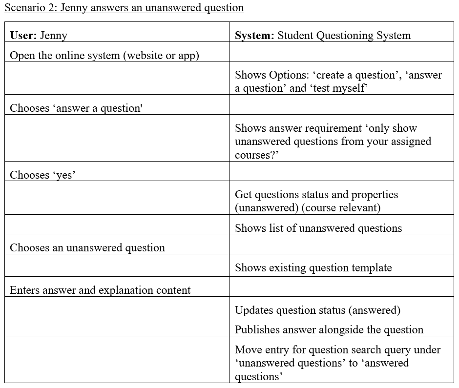

I have chosen Jenny for Scenario 2 because her persona describes how she likes to share her solutions with friends and possibly to an SQS. Seeing how Jenny will use an SQS will be beneficial in the design process for what Jenny should expect and be able to do. On the other hand, how the system should interact to provide the appropriate interfaces to answer an unanswered question. Jenny may not be fully committed to the SQS system but shows that she can come up with some answers which is why she is listed as Scenario 2.